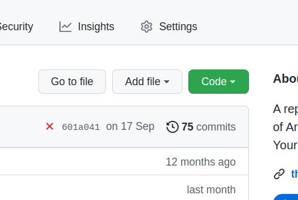

# Defining Stolen Land

This Chrome extension works by replacing all instances of the term `Crown Land` with `Stolen Land` to reflect the reality of colonial practices in North America.  This extension is a response to a tweet by [@ZoeSTodd](https://twitter.com/ZoeSTodd) who asked why there was no such extension.

Initial development of this extension was undertaken on the current and ancestral lands of the Musqueam, Squamish, and Tsleil-Waututh First Nations.  Contribution to this extension by settlers acknowledges our role as univited guests in the places we occupy and is an effort to recognize the importance of acknowledging the reality of our impact on this territory and the history of settlement within First Nations lands.

**NOTE** This extension isn't perfect.  There are text elements that seem to escape the search/replace tools in [runner.js](src/runner.js).  In particular, changes on Twitter only seem to be activated when the page is not maximized.  Opening a panel on a page also provides inconsistent results.

## Contributions

Contributions to the repository are welcome, but should be informed and should follow the [Code of Conduct](CODE_OF_CONDUCT.md) published as part of this repository.

* [Simon Goring](https://goring.org)

## How to Use This Extension

To install this extension directly from GitHub you can download the code directly to your computer by clicking the green **CODE** button on the GitHub page for the repository and selecting **Download ZIP**.

Once you've downloaded the zip file to your computer, unzip it to its own folder.  Navigate your browser to `chrome://extensions` and click on the *Developer Mode* switch in the top right of the page.  This will allow you to click *Load Unpacked* and then select the appropriate folder.  Once you've done that, the extension should be loaded.  You can test it out by doing a search for the term *Crown Land*.

### Issues and Errors

In some cases this extension may cause a page to load slowly.  In general it should not impact the behaviour of the underlying page.  If you do find issues and errors, please [contact me](mailto:simon.j.goring@gmail.com), or [raise an issue](https://github.com/StolenLand/issues), or please feel free to contribute to the code.
